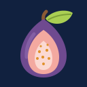

#  一日一字（く） (ichinichi-ichijiku)

**One kanji group a day.** Learn one Japanese kanji **radical group (部首)** or
**phonetic group (形声)** a day. A home-screen widget shows the day's group; tap it to
open the site, then tap the glyph to reveal its breakdown — the meaning, the words it
appears in, the reading it lends, and its kanji family.

🔗 **Live site:** https://vbkmr.github.io/ichinichi-ichijiku

> Sibling of **[一日一語 / ichinichi-ichigo](https://github.com/vbkmr/ichinichi-ichigo)**
> (one *word* a day). The name winks at **一字一句** (*ichiji-ikku*, "to the letter") and at
> **いちじく = 無花果 (fig)** — the fruit-pun cousin of ichigo's 🍓 (苺, strawberry).
